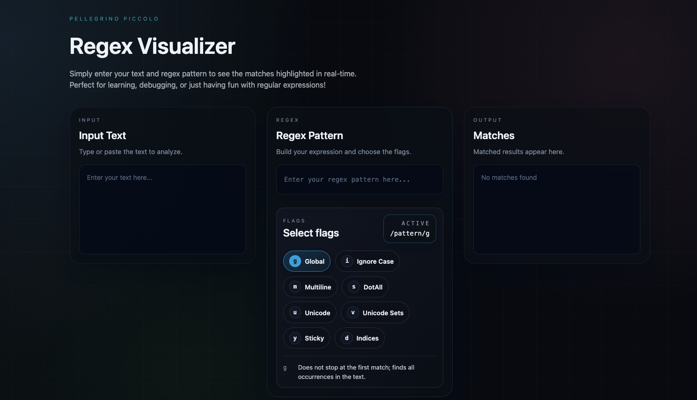
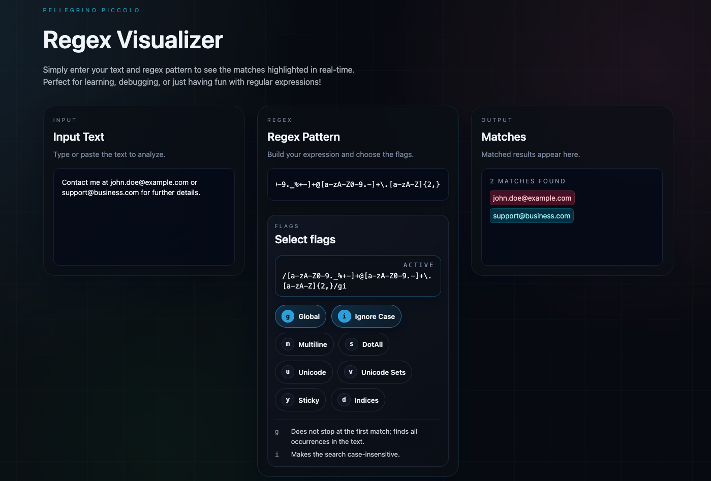

# Regex Visualizer

<p align="center">
  
</p>
<p align="center">
  A simple and interactive tool to test and visualize regular expressions in real time.
</p>

<p align="center">
  
  
  
</p>

---

## Live Demo

🔗 **Try it here:**

**[https://regex-visualizer.pages.dev/](https://regex-visualizer.pages.dev/)**

---

## Preview

### Main Interface



### Example Matches



---

## Features

* Real-time regex matching
* Match highlighting and counting
* Clean and modern UI
* Fast and lightweight
* Useful for learning and debugging regex

---

## Tech Stack

* React
* TypeScript
* CSS / Tailwind CSS

---

## Getting Started

### 1. Clone the repository

```bash
git clone https://github.com/PellegrinoPiccolo/regex-visualizer.git
cd regex-visualizer
```

### 2. Install dependencies

```bash
npm install
```

### 3. Run locally

```bash
npm run dev
```

---

## Usage

1. Enter text in the **Input** field
2. Enter a regex in the **Regex Pattern** field
3. View matches in the **Matches** panel

---

## Project Structure

```
src/
 ├── components/
 ├── assets/
 ├── utils/
 ├── App.tsx
 └── main.tsx
```

---

## Contributing

Contributions are welcome.

1. Fork the repository
2. Create your feature branch
3. Commit your changes
4. Open a Pull Request

---

## License

This project is licensed under the MIT License.

---

## Author

**Pellegrino Piccolo**

You can visit my portfolio here: **[https://piccolopellegrino.dev/](https://piccolopellegrino.dev/)**
